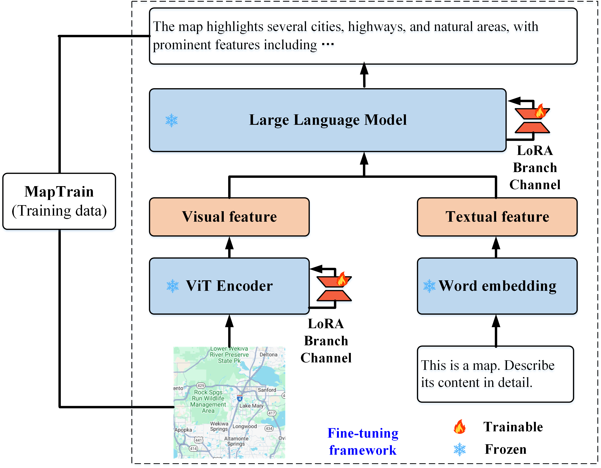

# MapReader: A framework for learning a visual language model for map analysis
Map analysis is a classic task in cartography, which is a prerequisite for users to understand geographic information, including geographic objects and their corresponding spatial relationships within maps. Therefore, intelligent map analysis is an important yet challenging topic that can enhance users’ ability to utilize maps effectively. Recently, the development of large models, especially Visual Language Models (VLMs), has shown potential for intelligent image analysis. However, these models are primarily trained on natural images, which have intrinsic differences from maps, such as unique layouts and symbols designed in maps. Consequently, there remains a gap in applying existing general-domain VLMs to map analysis. To address this issue, we propose a framework for developing a specialized VLM, called MapReader. To achieve this goal, a comprehensive data resource is first collected using a strategy that combines self-instruct with expert refinement, including training data (MapTrain) and evaluation data (MapEval). The training dataset MapTrain consists of 2,000 pairs of maps from various geographic contexts and their corresponding descriptions. Based on this training data, MapReader is fine-tuned on top of a general-domain VLM to learn to understand and describe map contents. To assess the model’s performance, an evaluation dataset MapEval is constructed from two perspectives: the accuracy in describing geographic objects and their spatial relationships within a given map (MapEval-DB, 250 map cases), and the effectiveness in answering given questions based on specific maps (MapEval-QA, 500 map related questions). The evaluation results suggest that: (1) MapReader can accept map inputs and generate detailed descriptions of core geographic information, and it also possesses visual question-answering capabilities, showing potential for application in various map analysis scenarios, such as accessible map reading and robotic map usage; (2) MapReader demonstrates significant improvements over general VLMs in identifying geographic objects and their spatial relationships; (3) The proposed data collection strategy is effective, and the collected dataset can serve as a benchmark to promote further research in this area.



## Prerequisites
### Set up Environment

```bash
# Create a conda environment
conda create -y -n MapReader python=3.9

# Activate the environment
conda activate MapReader

# CUDA >= 11.8
cd MapReader
pip install -r requirements.txt
```

### Datasets
We have released some of the data used to train MapReader and all of the evaluation data, which is stored in Data This includes the training data MapTrain, the evaluation data MapEval-DB, and MapEval-QA. 


## Training
Start the fine-tuning process with this command:
```bash
bash finetune_demo/finetune_lora.sh
```

## License
MapReader and all our publicly available data are intended for research preview and non-commercial use only, subject to the model License of CogVLM. Please contact us if you find any potential violations. If you have any questions, you can emaill us yuwh@cug.edu.cn.

## Citation Elsevier
MapReader has been accepted into the IJGIS Journal, If you use data and code from MapReader, please declare the following references(Will update later.):


